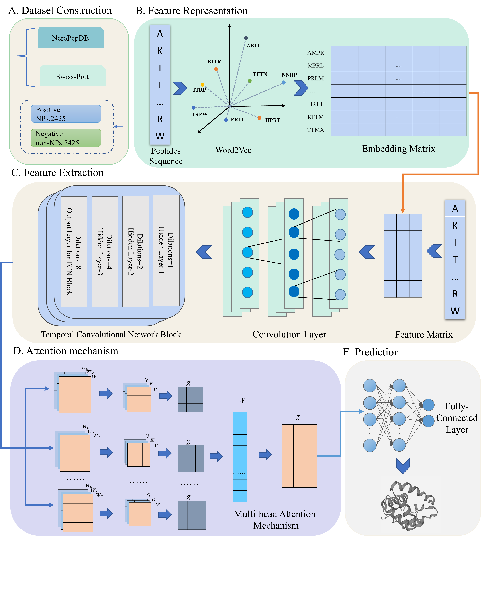

## If the program download fails, please contact us. The email address is as follows.
ml_csz@163.com
# NeuroPred-CLQ
NeuroPred-CLQ: Incorporating deep temporal convolutional networks and multi-head attention mechanism to predict neuropeptides

## Introduction
Motivation: 

Neuropeptides (NPs) are a particular class of informative substances in the immune system and physiological regulation. They play a crucial role in regulating physiological functions in various biological growth and developmental stages. In addition, neuropeptides are crucial for developing new drugs for the treatment of neurological diseases. With the development of molecular biology techniques, some data-driven tools have emerged to predict neuropeptides. However, it is necessary to improve the predictive performance of these tools for neuropeptides.

Results:
In this study, we developed a deep learning model (NeuroPred-CLQ) based on the temporal convolutional network (TCN) and multi-head attention mechanism to identify NPs effectively and translate the internal relationships of peptide sequences into numerical features by the Word2vec algorithm. The experimental results show that NeuroPred-CLQ learns data information effectively, achieving 93.6% accuracy and 98.8% AUC on the independent test set. The model has better performance in identifying neuropeptides than the state-of-the-art predictors. 



## Related Files

#### NeuroPred-CLQ

| FILE NAME           | DESCRIPTION                                                  |
| :------------------ | :----------------------------------------------------------- |
| data_process.py             | Data processing using the Word2vec method |
| layers.py           | The defined attention mechanism module |
| train.py            | train model |
| model.py            | model construction |
| test.py             | test model result |
| tools.py       | Some of the required functions |
| data                | data         |
| CLQ_model          | models of NeuroPred-CLQ           |


## Installation
- Requirement
  
  OS：
  
  - `Windows` ：Windows7 or later
  
  - `Linux`：Ubuntu 16.04 LTS or later
  
  Python：
  
  - `Python` >= 3.6
  
- Download `NeuroPred-CLQ`to your computer

  ```bash
git lfs install
git lfs clone https://github.com/GEHAH/NeuroPred-CLQ.git
  ```


## Run NeuroPred-CLQ on a new test fasta file
```shell
python predictor.py --file test.fasta --out_path result
```

- `--file` : input the test file with fasta format

- `--out_path`: the output path of the predicted results

